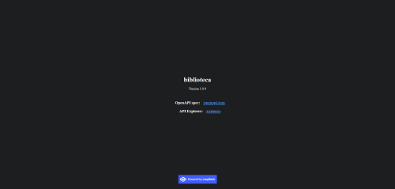

# Biblioteca - M3

Este repositorio foi criado para a Unidade Curricular de **Desenvolvimento Web I**, lecionada na **Universidade da Maia - ISMAI** no curso de **Informática**.  
Desenvolvido pelo **Group 04 : [@rodmoreira41](https://github.com/rodmoreira41), [@pauloazevedo1994](https://github.com/pauloazevedo1994), [@JoaoAragaoA039132](https://github.com/JoaoAragaoA039132)**.

## Short theme description

Construimos uma API que tem suporte nas relações entre os recursos 'Autor', 'Editora', 'Utilizador' e 'Livro'.

## Repository organization

* **Código Fonte** está na pasta [src](src/).
* **Código Fonte Resct-Admin** está na pasta [ra_src](src\react_biblioteca).
* **Documentação** está na pasta [doc](doc/).
* **Documento Base de Dados** está na pasta [base_dados](src\api_biblioteca\db\biblioteca.sql).
* **Documento Docker-Compose** está na pasta [docker_compose](docker-compose.yaml).

## Gallery

 

## Technologies

* Javascript (https://developer.mozilla.org/en-US/docs/Web/JavaScript/About_JavaScript)
* nodeJS (https://nodejs.org/en/)
* Markdown (https://www.markdownguide.org/)
* MySQL Workbench (https://www.mysql.com/products/workbench/)
* Postman (https://www.postman.com/)
* GitHub (https://github.com/)
* Docker (https://www.docker.com/)

### Frameworks and Libraries

* [Docker](https://docs.docker.com/get-started/overview/)
* [NodeJS](https://nodejs.org/en/about/)
* [React-Admin](https://marmelab.com/react-admin/Readme.html)

### Project presentation
* Chapter 1: [Project presentation](doc/c1.md)
### Resources
* Chapter 2: [Resources](doc/c2.md)
### Product
* Chapter 3: [Product](doc/c3.md)

## Team
* Rodrigo Moreira [@rodmoreira41](https://github.com/rodmoreira41)
* Paulo Azevedo [@pauloazevedo1994](https://github.com/pauloazevedo1994)
* João Aragão [@JoaoAragaoA039132](https://github.com/JoaoAragaoA039132)
