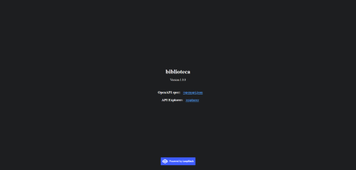
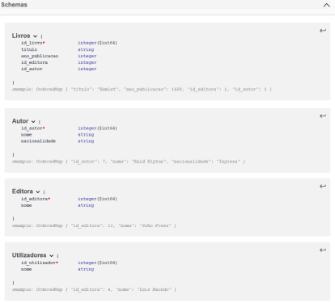

# C3 : Product

Fizemos os controladores, quando os acabamos fizemos start e foi nos possível ver a nossa API em funcionamento. Onde reparamos que estavamos com um erro de ligação a nossa base de dados, sendo que sempre que tentavamos fazer a ligação através do MySQL dava-nos erro na ligação á mesma, sendoa que a única opção que funcionava era quando faziamos na opção in-memory. Realizamos também as collections do postman, já no que diz respeito ao docker como estavamos com muitos problemas acabamos por não o realizar.

## 3.1 Development

Durante o desenvolvimento tivemos algumas dificuldades na ligação da nossa api á base de dados.

## 3.2 Instalation

Para realizar a instalação do Loopback seguimos os tutoriais disponibilizados pelo professor, utilizamos vários softwares como o MySQL WorkBench, Github Deskot, NodeJS, VSCode e o Postman.

## 3.3 Usage

Tivemos dificuldades na ligação da nossa API á nossa base de dados.

## 3.4 Implementation details

* **['database.sql'](../src/api_biblioteca/db/biblioteca.sql)** - Ficheiro com a criação do Schema e Tabelas a usar pelo container de MySQL e com a alteração de permissões para o utilizador;
* **['setup.sh'](../src/api_biblioteca/db/setup.sh)** - Script responsável por ligar o serviço MySQL, carregar a base de dados e desligar o serviço novamente;
* **['dockerfile.mysql'](../src/api_biblioteca/dockerfile.mysql)** - Ficheiro dockerfile responsável pela configuração da imagem MySQL, definição de espaço de trabalho;
* **['dockerfile'](../src/api_biblioteca/dockerfile)** - Ficheiro dockerfile responsável pela configuração da imagem da aplicação, definição de espaço de trabalho e definição do **port** que ficaria exposto;
* **['docker-compose.yml'](../src/api_biblioteca/docker-compose.yml)** - Ficheiro docker-compose que, durante o desenvolvimento, permitiu aos dois containers serem lançados em paralelo e estabelecerem uma ligação entre si;
* **['dockerfile'](../src/api_biblioteca/Dockerfile)** - Ficheiro dockerfile responsável pela configuração da imagem da interface gerada através do React-Admin, definição de espaço de trabalho e definição do **port** que ficaria exposto;
* **['docker-compose.yaml'](../docker-compose.yaml)** - Ficheiro docker-compose responsável por, numa versão final, facilitar a obtenção dos três containers, gerando também uma ligação entre os mesmos.

 

[< Anterior](c2.md) | [^ Main](../../../) | [Primeiro >](c1.md)
:--- | :---: | ---: 